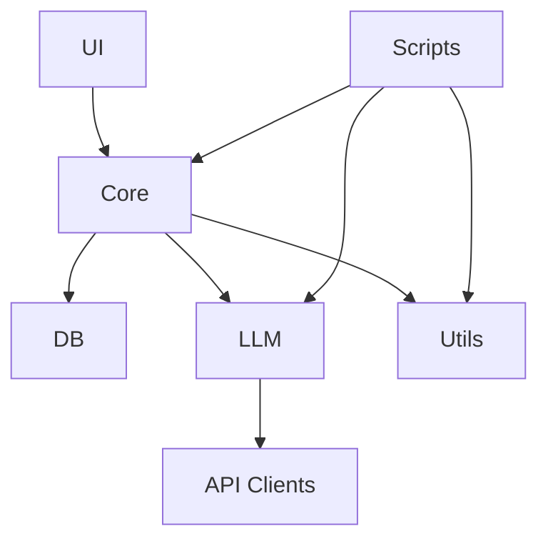

# Dewey Project Architecture

## Current Repository Structure

The Dewey project currently has the following high-level structure:

```
dewey/
├── src/
│   └── dewey/
│       ├── core/
│       │   ├── automation/
│       │   ├── bookkeeping/
│       │   ├── crm/
│       │   ├── db/
│       │   ├── engines/
│       │   └── research/
│       ├── llm/
│       │   ├── api_clients/
│       │   ├── prompts/
│       │   └── docs/
│       ├── scripts/
│       ├── ui/
│       ├── utils/
│       └── refactor/
├── config/
├── docs/
├── tests/
└── ui/
```

## Comparison with Conventions

### Alignment with Conventions

✅ Core module structure follows conventions with proper separation of concerns
✅ LLM module properly organized with api_clients and prompts
✅ Configuration centralized in config/dewey.yaml
✅ Tests directory parallel to implementation code
✅ Documentation in docs directory

### Deviations from Conventions

❌ `refactor/` directory not specified in conventions
❌ Some modules missing __init__.py files
❌ UI structure differs from conventions (both in src/dewey/ui and separate ui/ directory)
❌ Some modules missing proper documentation

## Module Purposes

### Core Module (`src/dewey/core/`)

The core module contains the primary business logic of the system:

- **automation/**: Handles automated tasks and workflow management
- **bookkeeping/**: Manages financial transactions and accounting
- **crm/**: Customer relationship management functionality
- **db/**: Database interactions and data management
- **engines/**: External API integrations and processing engines
- **research/**: Investment and financial research capabilities

### LLM Module (`src/dewey/llm/`)

Handles all large language model interactions:

- **api_clients/**: Implementations for different LLM providers
- **prompts/**: Structured prompts for different use cases
- **docs/**: Module-specific documentation and PRDs

### Scripts Module (`src/dewey/scripts/`)

Contains utility scripts and tools for:

- PRD management
- Code consolidation
- Architecture analysis
- System maintenance

### UI Module (`src/dewey/ui/` and `ui/`)

**Note**: Current structure deviates from conventions. Recommendation to consolidate under `src/dewey/ui/`.

### Utils Module (`src/dewey/utils/`)

Common utilities and helper functions used across the project.

### Refactor Module (`src/dewey/refactor/`)

**Note**: This directory is not specified in conventions. Consider:

1. Moving contents to appropriate modules
1. Updating conventions if the directory serves a specific purpose
1. Removing if no longer needed

## Recommendations for Convention Updates

1. **Directory Structure**

   - Add clear guidelines for handling refactoring work
   - Clarify UI module structure and resolve duplication
   - Add specifications for module-level docs directories

1. **Module Organization**

   - Add requirements for module-level README.md files
   - Specify required contents of __init__.py files
   - Define standards for module-specific documentation

1. **Configuration Management**

   - Add guidelines for module-specific configuration sections
   - Specify validation requirements for config sections
   - Document environment variable handling

1. **Documentation**

   - Add requirements for API documentation
   - Specify format for module-level documentation
   - Define standards for code examples

1. **Testing**

   - Add guidelines for test organization within modules
   - Specify requirements for test coverage
   - Define standards for test documentation

## Technical Debt Items

1. **High Priority**

   - Resolve UI module duplication
   - Add missing __init__.py files
   - Document refactor directory purpose or migrate contents

1. **Medium Priority**

   - Add missing module-level documentation
   - Implement consistent error handling
   - Standardize configuration validation

1. **Low Priority**

   - Update outdated documentation
   - Add missing code examples
   - Improve test coverage

## Next Steps

1. Review and update CONVENTIONS.md to reflect current structure
1. Create migration plan for UI module consolidation
1. Document or migrate refactor directory contents
1. Add missing module documentation
1. Implement consistent error handling across modules

## Appendix: Module Dependencies



This document should be reviewed and updated regularly as the project evolves.
