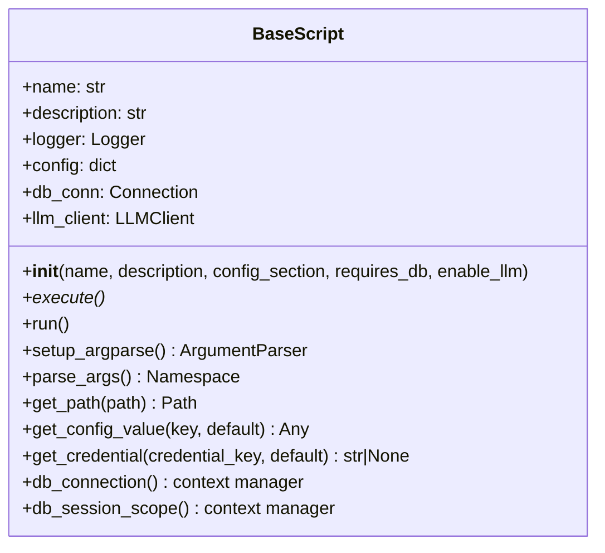

# BaseScript Documentation

## Overview
`BaseScript` is the foundational class for all scripts in the Dewey project. It provides standardized access to:
- Configuration management
- Logging facilities  
- Database connections
- LLM integrations
- Error handling



## Key Features

### Configuration Management
- Loads from `config/dewey.yaml`
- Supports section-specific configuration
- Environment variable interpolation
- Hierarchical key access (e.g. `"llm.model"`)

### Logging
- Configurable via YAML
- Standardized format
- Multiple log levels

### Database Integration
- Connection pooling
- SQLAlchemy session support
- Context managers for safe handling

### LLM Integration
- LiteLLM client
- Model configuration
- Error handling

## Usage

### Basic Implementation
```python
from dewey.core.base_script import BaseScript

class MyScript(BaseScript):
    def __init__(self):
        super().__init__(
            name="My Script",
            description="Example script",
            config_section="my_script",
            requires_db=True
        )

    def execute(self):
        """Main execution logic"""
        self.logger.info("Running script...")
        with self.db_connection() as conn:
            # Database operations
            pass
```

### Command Line Arguments
```python
def setup_argparse(self):
    parser = super().setup_argparse()
    parser.add_argument("--input", help="Input file path")
    return parser
```

## Lifecycle Methods

### `execute()`
**Abstract method** that must be implemented by subclasses. Contains the main script logic.

### `run()`
Legacy method (deprecated) that wraps `execute()` with error handling.

## Utility Methods

### `get_path()`
Resolves paths relative to project root.

### `get_config_value()`
Gets nested config values using dot notation.

### `get_credential()`
Retrieves credentials from env vars or config.

## Database Access

### Connection
```python
with self.db_connection() as conn:
    conn.execute("SELECT 1")
```

### Session (SQLAlchemy)
```python 
with self.db_session_scope() as session:
    results = session.query(MyModel).all()
```

## Best Practices
1. Always inherit from BaseScript
2. Use provided logging
3. Leverage configuration system
4. Utilize context managers for resources
5. Implement `execute()` rather than `run()`