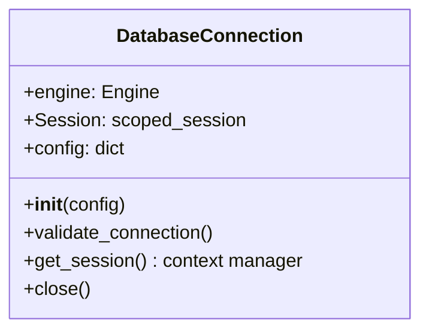

e# Database Connection System

## Overview
The database connection system provides PostgreSQL integration with:
- Connection pooling
- Session management
- Automatic reconnection
- SSL/TLS support
- Health monitoring



## Configuration
Database configuration is loaded from `config/dewey.yaml` under the `database` section:

```yaml
database:
  postgres:
    host: ${DB_HOST}
    port: ${DB_PORT}
    dbname: ${DB_NAME}
    user: ${DB_USER}
    password: ${DB_PASSWORD}
    sslmode: prefer
    pool_min: 5
    pool_max: 10
```

## Key Features

### Connection Pooling
- Configurable pool sizes
- Connection checkout tracking
- Pre-ping for stale connections

### Session Management
- Scoped sessions
- Automatic commit/rollback
- Context manager pattern

### Health Monitoring
- Periodic validation (every 5 minutes)
- Connection timeouts
- Keepalives

### SSL/TLS Support
- Multiple modes (prefer, require, verify-full)
- Certificate configuration

## Usage Examples

### Basic Connection
```python
from dewey.core.db import get_connection

# Get connection from config
db = get_connection(config)

# Execute raw SQL
with db.engine.connect() as conn:
    result = conn.execute("SELECT 1")
```

### Session Context
```python
from dewey.core.db import db_manager

# Using the global db_manager
with db_manager.get_session() as session:
    # SQLAlchemy operations
    session.query(User).filter(User.id == 1).first()
```

### Custom Configuration
```python
custom_config = {
    "postgres": {
        "host": "localhost",
        "port": 5432,
        "dbname": "mydb",
        "user": "user",
        "password": "pass"
    }
}

db = DatabaseConnection(custom_config)
```

## Best Practices

1. **Always use context managers** (`with` statements)
2. **Configure appropriate pool sizes** based on workload
3. **Enable SSL** for production environments
4. **Handle exceptions** properly
5. **Close connections** when done

## Error Handling

Common exceptions:
- `DatabaseConnectionError`: Connection/validation failures
- `SQLAlchemyError`: Database operation errors

```python
try:
    with db.get_session() as session:
        # Database operations
except DatabaseConnectionError as e:
    logger.error(f"Connection failed: {e}")
    # Recovery logic
```

## Performance Tuning

### Pool Sizing
- `pool_min`: Minimum connections to maintain
- `pool_max`: Maximum connections to allow

### Timeouts
- `connect_timeout`: Connection timeout (seconds)
- `keepalives_idle`: TCP keepalive interval

## Monitoring

Connection events are logged:
- Checkout/checkin from pool
- Validation failures
- Schema version changes