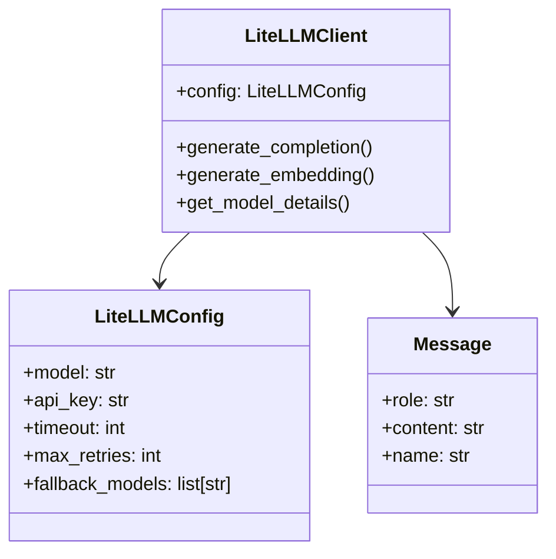

# LLM Integration System

## Overview
The LLM integration system provides a unified interface for interacting with various language models through LiteLLM. Key features:
- Multi-provider support (OpenAI, Anthropic, etc.)
- Configuration management
- Error handling
- Cost tracking
- Embedding generation



## Configuration

### YAML Configuration
```yaml
llm:
  model: gpt-4
  api_key: ${OPENAI_API_KEY}
  timeout: 60
  max_retries: 3
  fallback_models:
    - gpt-3.5-turbo
    - claude-2
  cache: true
```

### Environment Variables
```
LITELLM_MODEL=gpt-4
OPENAI_API_KEY=sk-...
LITELLM_TIMEOUT=60
LITELLM_FALLBACKS=gpt-3.5-turbo,claude-2
```

## Core Components

### `LiteLLMClient`
Main class for LLM interactions. Handles:
- Completion generation
- Embedding creation
- Model information
- Error recovery

### `LiteLLMConfig`
Stores configuration for:
- Model selection
- API keys
- Timeouts
- Fallback models
- Caching

### `Message`
Standardized message format for conversations:
- `role`: system/user/assistant/tool  
- `content`: Message text
- `name`: Optional tool name

## Usage Examples

### Basic Completion
```python
from dewey.llm import LiteLLMClient, Message

client = LiteLLMClient()
messages = [
    Message(role="system", content="You are a helpful assistant"),
    Message(role="user", content="Hello!")
]

response = client.generate_completion(messages)
print(response.choices[0].message.content)
```

### Embeddings
```python
embeddings = client.generate_embedding("Sample text")
print(embeddings["data"][0]["embedding"])
```

### With Configuration
```python
from dewey.llm import LiteLLMConfig

config = LiteLLMConfig(
    model="claude-2",
    timeout=90,
    fallback_models=["gpt-4", "gpt-3.5-turbo"]
)

client = LiteLLMClient(config=config)
```

## Error Handling

The system provides specific exceptions:
- `LLMAuthenticationError`: Invalid API keys
- `LLMConnectionError`: Network issues  
- `LLMRateLimitError`: Rate limits exceeded
- `LLMTimeoutError`: Request timeouts
- `LLMResponseError`: General errors

```python
try:
    response = client.generate_completion(messages)
except LLMRateLimitError:
    # Implement retry logic
    pass
```

## Best Practices

1. **Use fallback models** for reliability
2. **Set reasonable timeouts** (60-90s)
3. **Monitor costs** with `completion_cost()`
4. **Cache responses** when possible
5. **Handle errors gracefully** with retries

## Advanced Features

### Function Calling
```python
functions = [{
    "name": "get_weather",
    "parameters": {
        "location": {"type": "string"}
    }
}]

response = client.generate_completion(
    messages,
    functions=functions,
    function_call="auto"
)
```

### Streaming
```python
for chunk in client.generate_completion(
    messages,
    stream=True
):
    print(chunk.choices[0].delta.content)