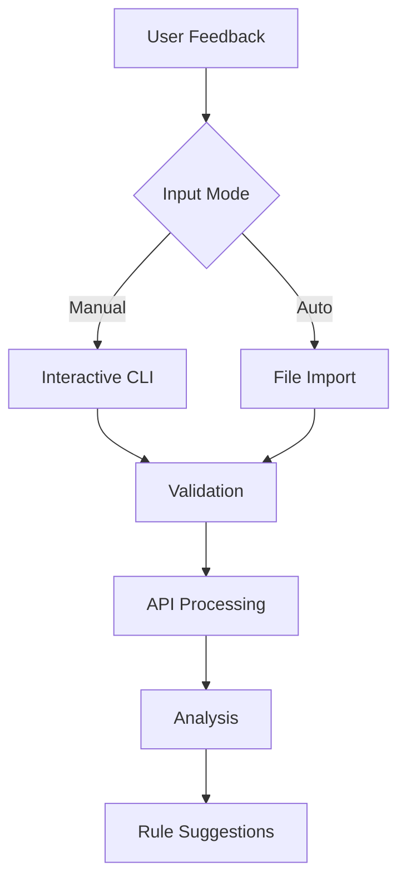

## Current Status
✅ Basic feedback ingestion & storage  
✅ Priority override rule suggestions  
✅ Manual feedback entry mode  
✅ API integration with DeepInfra  
🔄 JSON validation & error handling

## Enhancement Checklist

### Error Handling & Validation
- [ ] Add retry logic for API calls with exponential backoff
- [ ] Implement input validation for manual feedback entries
- [ ] Add schema validation for JSON responses using Pydantic
- [ ] Create automated tests for error scenarios

### User Experience
- [ ] Add colorized terminal output
- [ ] Implement progress indicators for long operations
- [ ] Add confirmation prompts for destructive actions
- [ ] Create interactive help system

### Code Quality
- [ ] Modularize core components (API, storage, analysis)
- [ ] Add type hints throughout codebase
- [ ] Implement configuration class for env vars
- [ ] Add benchmark tests for performance monitoring

### Security
- [ ] Implement API key rotation support
- [ ] Add rate limiting for API calls
- [ ] Encrypt sensitive fields in feedback.json
- [ ] Add audit logging

### Documentation
- [ ] Create full API documentation
- [ ] Add architecture diagram
- [ ] Write deployment guide
- [ ] Create maintenance checklist

## Next Priority Tasks
1. Implement retry logic for transient API errors
2. Add Pydantic models for data validation
3. Create test suite covering 90% of code paths
4. Develop configuration management system
>>>>>>> REPLACE
```

README.md
```markdown
<<<<<<< SEARCH
=======
# Feedback Processing System

Automates processing of email prioritization feedback and suggests rule improvements.

## Features

- 📥 Manual & automated feedback ingestion
- 🤖 AI-powered feedback analysis via DeepInfra
- 📊 Priority discrepancy analysis
- ⚙️ Rule suggestion engine
- 💾 JSON data persistence

## Setup

```bash
pip install python-dotenv openai
export DEEPINFRA_API_KEY="your-api-key"
```

## Usage

```bash
python process_feedback.py
```

## Core Functions

### `load_json(file_path: str) -> Union[dict, list]`
Loads JSON files with error handling  
**Params**:  
- `file_path`: Path to JSON file  
**Returns**: dict/list based on file content  
**Handles**:  
- Missing files  
- Empty files  
- Invalid JSON  

### `generate_feedback_json() -> dict`
Transforms natural language feedback into structured data  
**Flow**:  
1. Checks for quick patterns (e.g. "unsubscribe")  
2. Uses DeepInfra API for complex analysis  
3. Validates & cleans responses  
**Output**: Standardized feedback record

### `suggest_rule_changes() -> list`
Analyzes feedback patterns to propose system improvements  
**Detects**:  
- Common priority discrepancies  
- Frequent keyword associations  
- Source-based patterns  
**Output**: List of change recommendations

### `update_preferences() -> dict`
Safely applies changes to email preferences  
**Features**:  
- Prevents duplicate rules  
- Validate input formats  
- Dry-run mode for testing

## Architecture



## Environment Variables
`DEEPINFRA_API_KEY` - Required for AI processing  
`DB_URL` - Optional database connection  

